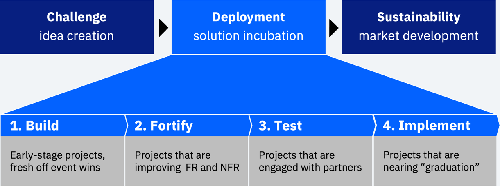

# Call for Code project catalog

 

This repository links to the projects created as part of [Call for Code](https://developer.ibm.com/callforcode/) activities. They may have their own GitHub organizations, goverance, and development processes.

- [Call for Code Deployment Framework](#call-for-code-deployment-framework)
- [Official Call for Code with The Linux Foundation projects](#official-call-for-code-with-the-linux-foundation-projects)
- [Contributing to Call for Code open source projects](#contributing-to-call-for-code-open-source-projects)
- [Other incubating or interesting projects](#other-incubating-or-interesting-projects)
- [Inactive or archived but of historical interest](#inactive-or-archived-but-of-historical-interest)

## Call for Code Deployment Framework

A deployment framework incubates projects that are recognized and awarded through the annual Call for Code Global Challenge or one of the Spot Challenges that may arise during the rest of the year. The end goal is to support the top projects from promising innovation until they reach a period of sustainability as open source projects with strong ecosystems of users and contributors.

## Official Call for Code with The Linux Foundation projects

There are fourteen official [Call for Code projects hosted by The Linux Foundation](https://www.linuxfoundation.org/projects/call-for-code/). This means that they have nearly graduated from the deployment framework pipeline shown above.

Each project at the LF is available for anyone to use and contribute to according to the Apache 2 License and Developer Certificate of Origin. They all have a project charter that defines a leadership team (the Technical Steering Committee), decision making processes, and contribution guidelines.

Since the LF owns the trademark for these projects, they may have two names. One is the neutral project name (such as Pyrrha), the other is the original project name carried forward separately by the creating team or organization (such as Prometeo).

- [OpenTempus](https://github.com/OpenTempus/OpenTempus) provides long-term (annual) weather forecasts for temperature and rainfall in order to help smallholder farmers make better decisions about what to plant and when.

- [OpenHarvest](https://github.com/Call-for-Code/OpenHarvest) is a platform designed to manage farmers, fields, and crops to ensure the farmers succeed in making profits.

- Protecting firefighters' health: [Pyrrha](https://github.com/Pyrrha-Platform). IoT and AI come together to monitor the levels of toxin exposure for firefighters and to alert them before they are in danger of long-term respiratory problems in this project from Prometeo the CFC 2019 Global Challenge winner.

- Build a mesh network after a natural disaster: [ClusterDuck Protocol](https://github.com/Call-for-Code/ClusterDuck-Protocol) This mobile mesh network of IoT devices based on LoRa can be accessed by people to stay in touch when communication lines go down following a disaster. From Project OWL, the CFC 2018 Global Challenge winner.

- Use AI to make home construction safer: [ISAC-SIMO](https://github.com/ISAC-SIMO) - This project from Build Change uses AI and computer vision to help detect construction issues that could become life-threatening during a major incident like a hurricane or earthquake. This project is an offshoot of PD3R, runner-up in the CFC 2018 Global Challenge.

- Notify communities quickly with Grillo’s simple earthquake early-warning system: [OpenEEW](https://github.com/openeew) - A low-cost IoT sensor measures expected shaking, giving local governments and first responders faster and better earthquake alerts.

- Help small farmers optimize water usage: [Liquid Prep](https://github.com/Liquid-Prep) - This end-to-end solution, originally developed by a team inside of IBM, can help small farmers understand how much water they are using. CFC IBMer Challenge 2019 winner.

- Aerial scout for first responders: [DroneAid](https://github.com/Call-for-Code/DroneAid) - This solution uses machine learning to detect calls for help on the ground placed by those in need. CFC Puerto Rico local winner in 2018.

- Musical collaboration for disconnected performers: [Rend-o-matic](https://github.com/Rend-o-matic) - Helping musicians jam together even when socially distanced, this tool from Choirless analyzes and merges musical waveforms to create a version of a track that can be continually updated. CFC IBMer Challenge 2020 runner up.

- [Call for Code for Racial Justice](https://github.com/Call-for-Code-for-Racial-Justice) - These seven project repositories are in a parallel organization.

  - [Fair Change](https://github.com/Call-for-Code-for-Racial-Justice/FairChange). Mobile application to capture incidents and provide information to police officers aimed at avoiding escalation, including a map view to enable search and visualization of incident clusters.

  - [TakeTwo](https://github.com/Call-for-Code-for-Racial-Justice/TakeTwo). TakeTwo is an app that aims to reduce racial bias in digital content, whether it is overt or subtle, with a focus on text across news articles, headlines, web pages, blogs, and even code.

  - [Truth Loop](https://github.com/Call-for-Code-for-Racial-Justice/Truth-Loop). Truth Loop is an app that helps communities simply understand the policies, regulations, and legislation that will impact them the most. Based on these insights, citizens can share their approval, concerns, and/or questions with lawmakers.

  - [Open Sentencing](https://github.com/Call-for-Code-for-Racial-Justice/Open-Sentencing). The Open Sentencing solution starter helps expose bias and empowers public defenders to address racial disparities in the judicial system directly. We created a tool with the goal of reducing sentencing for people impacted by bias and racism.

  - [Incident Accuracy Reporting System (IARS)](https://github.com/Call-for-Code-for-Racial-Justice/Incident-Accuracy-Reporting-System). Incident Accuracy Reporting System (IARS) is a Content Management application that addresses the issue of transparency surrounding police incident reporting by allowing witnesses and/or victims to directly submit evidence (images, videos).

  - [Five Fifths Voter](https://github.com/Call-for-Code-for-Racial-Justice/Five-Fifths-Voter). This web app empowers minorities to exercise their right to vote and ensures their voice is heard by determining optimal voting strategies and limiting suppression issues.

  - [Legit-Info](https://github.com/Call-for-Code-for-Racial-Justice/Legit-Info). Local legislation can have significant impacts on areas as far-reaching as jobs, the environment, and safety. Legit-Info helps individuals understand the legislation that shapes their lives.

## Contributing to Call for Code open source projects

Each repository contains information on how to use and provide improvements to the project.

- The `LICENSE` file shows source code usage guidelines, most often using the Apache 2 License terms.
- The `CONTRIBUTING.md` file captures the process for reporting problems or sending improvements.
- Together with the _Technical Charter_, these files outline the rules of the road and how decisions are made around technical changes and expectations around effective collaboration.

If you are new to the open source process, philosophy, and tools, we highly recommend that you take the [entry-level, free "Introduction to Open Source" class](https://cognitiveclass.ai/courses/introduction-to-open-source) from the IBM Developer team which can be completed in about 2-6 hours.

## Other incubating or interesting projects

These projects are not officially hosted at The Linux Foundation, but some do have active communities or more recent offshoots or pivots. They might also serve as starting points for new projects.

- [Project OWL](https://github.com/Project-Owl) projects that are not part of the ClusterDuck Protocol core Linux Foundation project.

- [Safe Queue](https://github.com/sparrow-platform) - An Intelligent ubiquitous communication platform for medical and psychological well-being of disaster victims. [Website](https://sparrow-platform.com/). CFC 2020 finalist and COVID track early recognition winner.

- [Al-Wasl.Connect](https://github.com/Call-for-Code/Al-Wasl.Connect). A platform where NGOs, Donors and centralized authority all will come together and distribute ration and other goods to needy/requested people. Used in the CFC Beirut Spot Challenge.

- [PD3R](https://github.com/Call-for-Code/PD3R), Post-Disaster Rapid Response Retrofit. Assesses buildings after earthquakes using expertise from Build Change packaged into machine learning models. An offshoot lives in on [ISAC-SIMO](https://github.com/ISAC-SIMO).

- [Karmen](https://github.com/Call-for-Code/Karmen-PWA) discerns legitimate, benign COVID-19 messages from cybercriminals’ scam messages. CFC IBMer Challenge 2020 winner.

- [Sparrow Platform](https://github.com/sparrow-platform) - An Intelligent ubiquitous communication platform for medical and psychological well-being of disaster victims. [Website](https://sparrow-platform.com/). CFC 2019 finalist.

- [Project AsTeR](https://github.com/cal-aster/data-911). AI-Powered Real-Time Emergency Calls Analysis and Effective Units Dispatching. The project has created an updated prototype called Data911. CFC 2019 finalist.

- [Project Lantern](https://github.com/lantern-works), Long-Range Wireless Apps. CFC IBMer Challenge 2018 finalist.

## Inactive or archived but of historical interest

Not all projects graduate from the framework for one reason or another, but they may be of historical or educational interest.

- [DamageCheck](https://github.com/Call-for-Code/DamageCheck), Augmented reality earthquake damage assessment tool / simulator. Proof of concept to inspect earthquake damaged building interiors.

- [Healios](https://gitlab.com/xuelongmu1/healios-ibm) - Healios streamlines the process for case workers to connect with survivors who may be coping with negative mental health symptoms.

- [Rove](https://github.com/Call-for-Code/Rove), Respond, Organize, Visualize Emergencies. CFC 2019 finalist.

- [Frida](https://github.com/Call-for-Code/Frida), AI and IoT comes to the aid of teachers, students, and first responders. CFC IBMer Challenge 2018 winner.

- [AI-mergency](https://github.com/Call-for-Code/AI-mergency) Control Room (AICR), understanding and consolidating requests for help with Watson. CFC IBMer Challenge 2018 finalist.

- [Helpchain](https://github.com/Call-for-Code/Helpchain), your donation with trust and transparency. CFC IBMer Challenge 2018 finalist.

- [United Aid Net](https://github.com/cellchip/kai) - United Aid Net (UAN) is a global emergency assistance network for uninterrupted financial services after natural disasters. A CFC IBMer Challenge 2018 finalist.
